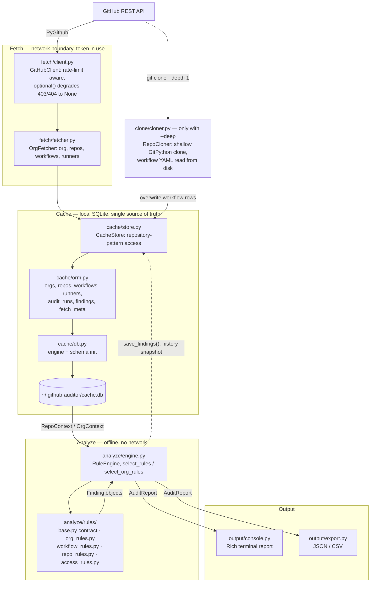

# Architecture

`github-auditor` is a batch pipeline, not a service. One command — `gha audit your-org`
— walks an organization through four stages: **fetch** everything security-relevant from
the GitHub API, **cache** it in a local SQLite database, optionally **clone** repositories
for a deeper workflow read, **analyze** the cached data with a registry of rules, and
**output** the result as a terminal report or a machine-readable export.

Two properties are worth stating up front, because they are what a security reviewer
usually wants to know before pointing this tool at an entire org:

- **The token is only used during fetch (and clone).** Analysis is strictly offline: the
  rule engine reads the SQLite cache and makes no network calls at all. You can fetch once
  with a privileged token and then re-analyze as many times as you like with no token
  present.
- **Everything the tool learns lands in one place on disk** — `~/.github-auditor/`, holding
  `cache.db` and, only when `--deep` is used, shallow clones under `clones/`. That
  directory is the tool's entire persistent footprint, and `gha cache clear` removes it.

## The pipeline

The CLI in `src/github_auditor/cli/__init__.py` (Typer) is the only place these stages are
wired together. `gha audit` runs fetch-then-analyze-then-output; `gha fetch` stops after
the cache is populated; `gha report`, `gha repos` and `gha findings` skip fetching and work
purely from what is already cached.

### Fetch

`src/github_auditor/fetch/fetcher.py` owns this stage. `OrgFetcher.sync()` resolves the
target (an organization or a user account), lists its repositories, and fans the per-repo
detail fetches out over a thread pool sized by `max_workers`. For each repository it
collects the posture that the rules care about: visibility and archived state, Actions
permissions and default workflow token permissions, branch protection on the default
branch, deploy keys, outside collaborators, secret scanning and push protection, Dependabot
alerts, and self-hosted runners. Organization-level settings (2FA requirement, base member
permission, org-wide workflow permissions, fork PR approval policy) and org-level runners
are fetched once per sync by `OrgFetcher.fetch_org()`.

Every API call goes through `src/github_auditor/fetch/client.py`. `GitHubClient` is a thin
PyGithub wrapper with two important behaviours. `guarded()` handles primary rate-limit
exhaustion by waiting for the reset once, rather than failing the sync. `optional()` runs a
call that requires elevated permissions and returns `None` when the token cannot see the
endpoint — so a fine-grained token with a narrow scope produces a *smaller* audit rather
than a failed one. That `None` is load-bearing all the way through to the rules: posture
fields are tri-state, and "unknown" is never reported as a finding.

Errors are isolated per repository: one repo that fails to fetch is recorded in
`SyncResult.errors` and reported at the end, and the rest of the sync continues.

### Cache

`src/github_auditor/cache/store.py` is the only module that reads or writes the database.
`CacheStore` exposes repository-pattern methods (`upsert_org`, `upsert_repo`,
`upsert_workflows`, `replace_runners`, `list_repos`, `get_workflows`, `get_runners`,
`save_findings`, …) over the SQLAlchemy tables declared in
`src/github_auditor/cache/orm.py`, and `src/github_auditor/cache/db.py` creates the SQLite
engine (WAL journaling, foreign keys on) and initializes the schema, refusing to open a
database whose `PRAGMA user_version` does not match the code's `SCHEMA_VERSION`.

Storage is deliberately hybrid: the columns needed for filtering and sorting (org login,
full name, visibility, archived, pushed-at, severity, rule id) are real columns, while the
complete Pydantic model dump lives in a JSON `data` column so a cached row round-trips
losslessly back into the same model the fetcher produced.

## What is persisted versus what is recomputed

**Persisted as inputs.** The fetched facts about the world are what the cache is for:
`OrgRow` (one per organization or user), `RepoRow` (one per repository), `WorkflowRow` (one
per workflow YAML file, including its raw content and whether it came from the API or a
clone), and `RunnerRow` (self-hosted runners at org or repo level). `FetchMetaRow` records
a `(kind, key) -> fetched_at` timestamp for freshness bookkeeping. These rows are the sole
input to analysis.

**Persisted as history, never read back as input.** At the end of an audit, `RuleEngine`
opens an `AuditRunRow` via `CacheStore.start_audit_run()`, writes each batch of findings as
`FindingRow`s through `CacheStore.save_findings()`, and closes the run with repo and finding
counts. This snapshot exists purely so `gha report` and `gha findings` can re-read the last
run without recomputing, and so you can see how an org's posture changed over time. The
rule engine never reads a `FindingRow` as an input to a check.

**Recomputed every run.** Findings themselves. `RuleEngine.analyze_org()` lists the cached
repos, builds a fresh `RepoContext` per repository from the cached org/repo/workflow/runner
rows (parsing each workflow's YAML on the way through
`analyze/workflow_parser.py`), builds one `OrgContext` from the cached org row, and
re-evaluates every selected rule against them. Nothing about a finding is memoized: change a
rule, change a threshold in `Settings`, or pass a different `--rules` selection, and the next
analyze run produces the new answer from the same cached facts, with no API traffic.

A workflow file that cannot be parsed is not silently dropped — `build_context()` emits an
informational `PARSE` finding naming the file, so a rule's silence about a workflow is never
ambiguous.

### Freshness: the TTL and `--refresh`

`cache_ttl_hours` in `src/github_auditor/config.py` (environment variable
`GITHUB_AUDITOR_CACHE_TTL_HOURS`, default `24.0`) defines how long a cached fact is
considered current. `OrgFetcher` converts it to a `timedelta` and consults
`CacheStore.is_fresh(kind, key, ttl)`, which compares the stored `fetch_meta` timestamp
against now, at two granularities:

- the organization itself, keyed `("org", org)` — if fresh, `fetch_org()` is skipped and the
  cached org settings are reused;
- each repository's details, keyed `("repo_detail", full_name)` — repos still inside the TTL
  are counted in `SyncResult.from_cache` and are not re-fetched at all.

Note that the *repo listing* is always pulled: the fetcher needs the current set of repos to
detect deletions (`delete_repos_not_in()` drops cached repos that no longer exist upstream).
The TTL governs the expensive per-repo detail calls, which is where the API budget goes.

The CLI's `--refresh` flag (on `gha audit` and `gha fetch`) is passed straight through to
`OrgFetcher.sync()` and short-circuits both freshness checks, forcing a re-fetch of the org
and every repository regardless of how recently they were cached. It does not clear the
cache — it overwrites rows in place — so `--refresh` costs API calls but never loses
history. To actually discard cached data, use `gha cache clear` (optionally `--org`).

Setting `GITHUB_AUDITOR_CACHE_TTL_HOURS=0` makes every fetch behave as if `--refresh` were
passed; a large value makes repeated audits essentially free after the first sync.

## How `--deep` changes the pipeline

By default, workflow YAML is read over the API. `OrgFetcher.fetch_workflows()` lists the
contents of `WORKFLOW_DIR` (`.github/workflows`) and decodes each entry's content; when a
file is too large for the contents endpoint to inline, it falls back to fetching the git
blob and base64-decoding it. Each file is stored as a `WorkflowRow` with `source="api"`.

With `--deep`, the CLI runs an extra pass (`_deep_scan()`) after the sync. For every
non-archived repository that has at least one cached workflow, `RepoCloner` in
`src/github_auditor/clone/cloner.py` performs a shallow GitPython clone (`depth` from
`clone_depth`, single branch, default branch only) into `~/.github-auditor/clones/<org>/<repo>`,
or fetches and hard-resets an existing clone; a clone that turns out to be corrupt is deleted
and remade. `read_workflow_files()` then reads every `.yml`/`.yaml` under `.github/workflows`
directly from disk and re-upserts the workflow rows with `source="clone"`, replacing the
API-sourced content. Analysis afterwards is identical — the rules do not know or care which
path produced the text they are reading.

The deep path is worth its cost when the API listing is incomplete or truncated, or when
you want byte-exact file content rather than the API's view of it. It is strictly additive:
repos that fail to clone log a `CloneError` and keep their API-sourced workflows.

**Credential handling during clone.** The token is never written to disk in a form that
outlives the operation. `_with_token()` embeds it in the HTTPS remote URL only for the
duration of the clone, and immediately afterwards the origin URL is reset to the clean
`clone_url`. For updates of an existing clone, the `_authenticated_remote()` context manager
sets the token-bearing URL, performs the fetch, and restores the clean URL in a `finally`
block, so the token is scrubbed from `.git/config` even if the fetch raises. A clone left on
disk therefore contains no credentials.

## The rule contract and dispatch

### The contract

`src/github_auditor/analyze/rules/base.py` defines what a rule is. `RuleBase` carries the
identity that every rule declares as classvars: `id` (the stable identifier such as `GHA009`
or `ORG007`, matched by `--include`/`--exclude` and listed in the README tables), `name` (a
short kebab-case slug, also matchable on the CLI), `default_severity` (a `Severity` member),
`description` (prose explaining the attack, shown in the report), and `remediation` (the
concrete fix, defaulting to an empty string). The inherited `finding()` helper builds a
`Finding` with all of that identity filled in plus the repo or org attribution, so a rule
body only supplies what is specific to the occurrence: `title`, an optional `severity`
override, `location`, and `evidence`.

There are two subclasses, chosen by what the check needs to see:

- `Rule` — repository-scoped. Implements `check(ctx: RepoContext)` and runs once per
  repository. `RepoContext` carries the org login, the `RepoInfo`, the parsed workflows, the
  raw workflow rows, the `OrgInfo` (so a repo rule can consider org defaults), org-level and
  repo-level runners, and the active `Settings`.
- `OrgRule` — organization-scoped. Implements `check(ctx: OrgContext)` and runs once per
  audit. `OrgContext` carries just the org login, the `OrgInfo` and the `Settings`, and its
  findings are attributed to the `ORG_SCOPE` sentinel rather than to any repository.

Both `check` methods are generators: yield one `Finding` per distinct problem, and yield
nothing for a clean subject. The house rule that governs precision is that *unknown is never
a finding* — posture fields are tri-state, and a rule fires only on an explicit bad value,
never on a `None` that merely means the token could not see the setting.

Rules live in the module matching their subject: `org_rules.py` (`ORG…`),
`workflow_rules.py` (`GHA…`), `repo_rules.py` (`REPO…`) and `access_rules.py` (`ACC…`), and
each is registered in `analyze/rules/__init__.py` in either `ALL_RULES` or `ALL_ORG_RULES`.
Those two lists are the registry — a rule absent from them never runs.

### Dispatch

`src/github_auditor/analyze/engine.py` turns the registry into a run. `select_rules()` and
`select_org_rules()` instantiate the classes from `ALL_RULES` and `ALL_ORG_RULES`, filtering
on a case-insensitive match of either `id` or `name` against the include and exclude sets
that the CLI derives from `--rules` and `--exclude-rules`. No `--rules` selection means
"run everything"; exclusion always wins over inclusion.

`RuleEngine.analyze_org()` then drives the whole analysis against the cache:

1. `analyze_org_settings()` loads the cached `OrgInfo`, builds one `OrgContext`, and runs
   every selected org rule. If the org was never fetched, it yields nothing rather than
   guessing.
2. For each cached repository (archived ones included unless `--no-archived` is passed),
   `build_context()` loads that repo's workflow rows, parses each into a `ParsedWorkflow`,
   partitions the org's runners into org-level and repo-level, and assembles the
   `RepoContext`. `analyze_repo()` then runs every selected repo rule over it and collects
   the findings.
3. Findings are accumulated into an `AuditReport` (org findings first, then one
   `RepoRiskReport` per repository, from which the risk score and A–F grade are derived)
   and, unless persistence is disabled, written to the `audit_runs`/`findings` snapshot
   described above.

Nothing in this stage touches the network, which is what makes `gha report` reproducible and
makes rule development possible with no token: the test suite in `tests/` builds
`RepoContext` and `OrgContext` objects directly from fixtures and exercises each rule in
isolation.

## Output

`src/github_auditor/output/console.py` renders the human-facing view with Rich: an org-wide
findings panel first (those apply to every repository beneath them), then a summary table of
repositories sorted by risk score with per-severity counts and an A–F grade, and a
per-repository detail view for `gha report --repo`. It also renders the rule catalogue for
`gha rules` and cache statistics for `gha cache info`.

`src/github_auditor/output/export.py` produces the machine-readable forms: `report_to_json()`
serializes the whole `AuditReport`, `findings_to_json()` and `findings_to_csv()` flatten a
finding list for downstream tooling. Both are plain functions over the report model, so
adding a new format means adding a function here and a branch in the CLI's format handling
— nothing upstream of output needs to change.

For CI use, `gha audit --fail-on <severity>` compares the report's findings against a
threshold and exits `1` when any finding at or above it exists.

## Configuration and trust boundaries

All tunables live in `Settings` in `src/github_auditor/config.py`, loaded from the
environment (prefix `GITHUB_AUDITOR_`) or an optional `.env` file: the token, the data
directory, the database path, the clone directory, `cache_ttl_hours`, `max_workers`,
`clone_depth`, `stale_years`, `trusted_action_owners` and the log level. The token is held as
a pydantic `SecretStr` so it does not leak into logs or reprs, and is read out only where an
API client or a git remote genuinely needs it.

The trust boundaries, restated as a reviewer would draw them:

- **GitHub API → fetch** is the only place the token is used for reads, and every privileged
  call is wrapped so that a permission failure becomes "unknown" rather than an error or a
  false finding.
- **fetch/clone → disk** writes org, repo, workflow and runner data — including full workflow
  file contents — into an unencrypted SQLite database under the data directory. Treat
  `cache.db` as sensitive: it is a map of an organization's weak spots. Clones under
  `clones/` contain repository content but, as described above, no credentials.
- **cache → analyze → output** involves no network and no secrets. A report or export
  contains findings, file paths and evidence strings drawn from workflow files, so it inherits
  the sensitivity of the repositories it describes.
